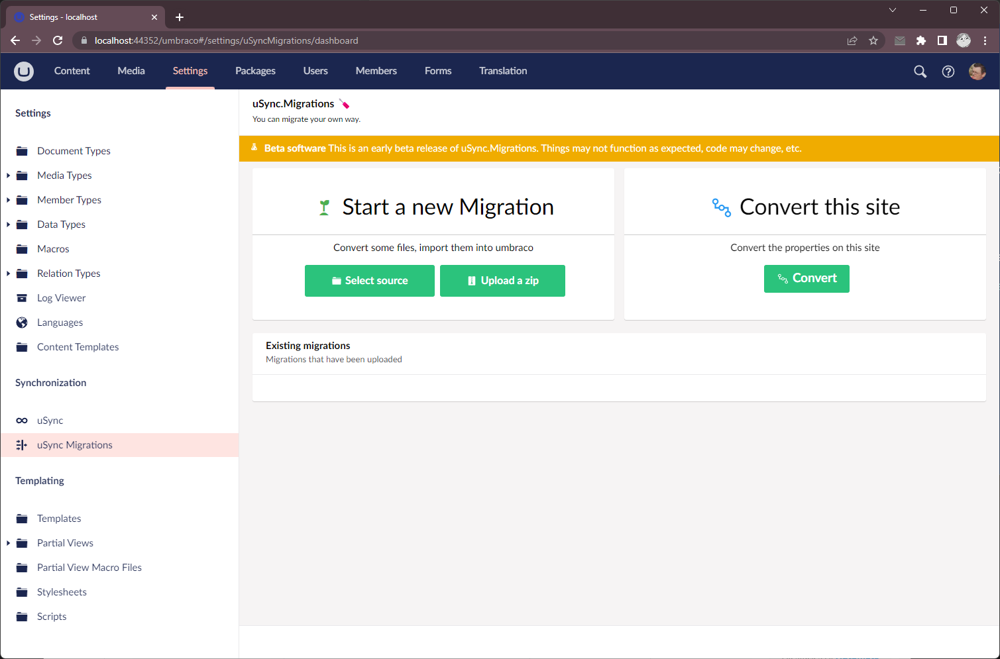
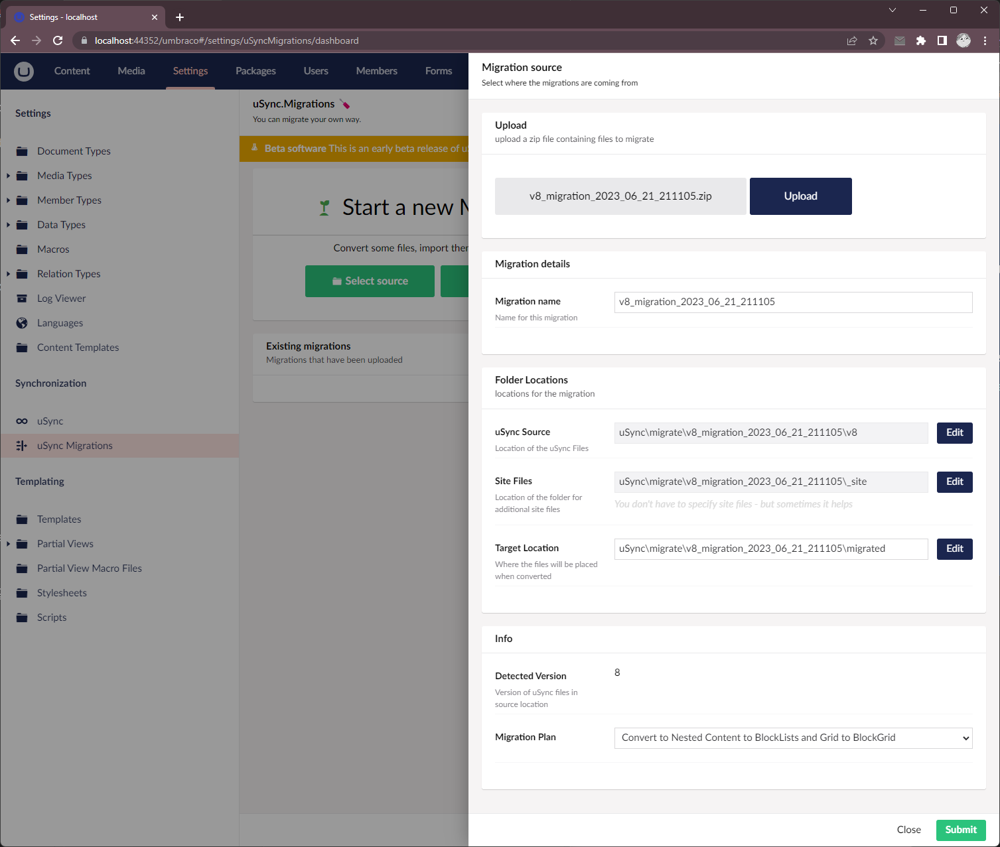
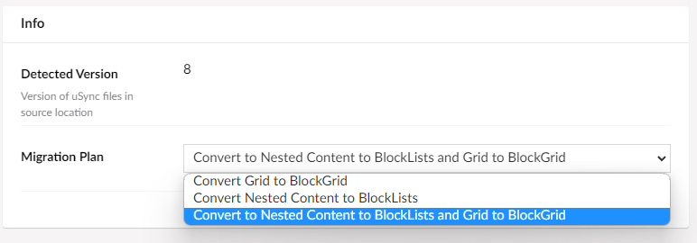
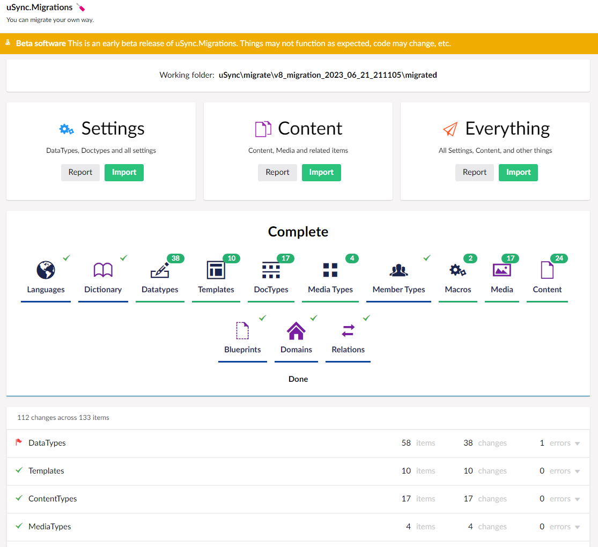

# Getting Started.

This is a quick guide to starting your migration journey with uSync.Migrations. 

> **Please Note:** uSync.Migrations isn't going to be one button - here is your new site migration. uSync.Migrations will help your with your settings and content, you will need to look at code, templates and all that other stuff. 


## Step One : Pick a packer 
*(Optional but recommended)*

uSync Packers are simple packages for Umbraco 7 and Umbraco 8, that use gather up the files from that version of umbraco and give you something you can kickstart your migration with. 

### On your source site install one of hte uSync.Migration.Packer packages


| Umbraco 7 | Umbraco 8
| - | -
| uSync.Migrations.Packer v7 | uSync.Miugrations.Packer v8


A package will create a new uSync export, and grab some extra files such as the css/script and a sepecially generated `grid.config.js` file and put them all into a .zip package. 

you can then use the .zip package on uSync migrations to start the process proper.

## Step Two: Migrate ! 

You can start with a new blank install of Umbraco:

1. Install uSync

```
dotnet add package uSync
```

2. Install usync.Migrations

```
dotnet add package uSync.Migrations --prerelease
```

3. Run your site, navigate to the uSync.Migrations section : 



4. Upload your zip file created by the package. 



> When you upload a zip file, usync Migrations will find the correct uSync and site folders for for you - you can do this yourself, but using the zip is much eaiser. 

5. When uploading you should select the "migration plan" which controls the type of migration your want. 



6. Submit.

## Convert 

The first step of any migration with uSync migrations is the conversion.

Converting the files, takes the orginal uSync files and converts them to the latest version and depending on your plan it changes types, upgrades things as it goes. 

> This is the step that can convert files to nested content to block list, grids to block grids. The actual changes don't occur until you import but the conversion is where the magic happens. 

### Validation
Before a conversion occurs usync.Migrations will validate the folders and tell you of anything it doesn't know how to do. 


> uSync.Migrations comes with lots of mappers to convert old content types to new, but if its missing one you need you can always write that converter and contribute back to the core uSync.Migrations for others to benifit.

### Convert

Press the big green button, go on you know you want to !

## Import

Once you have converted your files you can perform the import. 


Importing is the same as a normal uSync import except it comes from the migration folder.



## Enjoy & Start the long journey

At this point if everything has gone well you should have all your content and settings imported into your new site. Lovingly converted to new types (if you chose to do that) and ready for you to complete the migration.

All you have to do now is : 
- Find replacements for all those packages you use to have.
- rewrite all the templates and views 😰
- Rewrite all your controlers, services, etc

**Its going to take a little while longer than the migration just did**

## Rembmer You can always do it again.

uSync.Migrations is designed so you can run the smae migration again and again. You might run a migration once (or more) to get it right - but its likely you will need to do it again before you go live. If you visit the uSync.Mirgrations dashboard, you will now see a table of migrations that you have ran. 


From the dashboard, you can rerun conversions, re-import things and generally tweak your migration process.


> Always have a backup, don't blame us if it goes wrong, wear sunscreen, enjoy. 